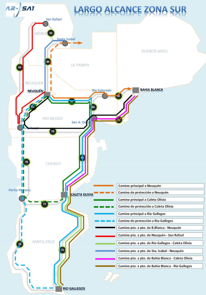

# Proyecto de Actualización de la REFEFO - Zona Sur

## Descripción General

Este repositorio documenta el desarrollo del trabajo final para la materia **Comunicaciones Ópticas** (2025), centrado en la actualización de la **Red Federal de Fibra Óptica (REFEFO)** de ARSAT en la zona sur de Argentina. El objetivo principal es modernizar la infraestructura existente para satisfacer las crecientes demandas de conectividad y mejorar la calidad del servicio en la región.

## Objetivos del Proyecto

- **Actualización de Interfaces**: Reemplazar interfaces de 10 Gbps por 100 Gbps, y aquellas de 40/100 Gbps por 400 Gbps, conforme a las especificaciones técnicas proporcionadas.

- **Ampliación de Capacidad**: Incrementar la cantidad de longitudes de onda utilizadas por los nodos ROADM, diseñando para un máximo de hasta 40 longitudes de onda en la ventana de 1550 nm.

- **Análisis y Simulación**: Realizar cálculos teóricos detallados y simular los caminos principales utilizando el software de simulación `gnpy.app`, evaluando parámetros como OSNR y GSNR para garantizar la calidad del servicio.

- **Selección de Equipamiento**: Determinar y justificar la elección de equipos activos y componentes pasivos necesarios para la implementación del "up-grade".

## Alcance Geográfico

La zona sur abarca las siguientes localidades y nodos ROADM:

- **Neuquén**
- **Bahía Blanca**
- **Caleta Olivia**
- **Río Gallegos**
- **Perito Moreno**
- **Dina Huapi**
- **San Antonio Oeste**
- **Rio Colorado**

## Estructura del Repositorio

- `Proyecto Integrador 2do parcial Comunicaciones Opticas 2025.pdf`: Documento con la consigna oficial del proyecto.
- `Anexo 9 - Matriz de Trafico de Largo Alcance.pdf`: Datos de tráfico actuales y proyectados para la zona sur.
- `Anexo 9 - Suma de interfaces por equipo.pdf`: Resumen de interfaces existentes y requeridas post-upgrade.
- `Anexo 9 - Tramos de Agregacion Regional.pdf`: Información sobre los tramos de agregación regional relevantes.
- `Anexo 11.pdf` y `Anexo 11-b.pdf`: Detalles técnicos adicionales y especificaciones de equipamiento.
- `Anexo 9 - Gráficos MATRIZ TRAFICO - Sur.pdf`: Visualización gráfica de la matriz de tráfico para la zona sur.

## Metodología

1. **Recolección de Datos**: Análisis de la infraestructura existente utilizando los documentos proporcionados por la cátedra y ARSAT.
2. **Cálculos Teóricos**: Elaboración de planillas de cálculo para determinar presupuestos de potencia, compensación de dispersión cromática y evaluación de OSNR y GSNR.
3. **Simulación con `gnpy.app`**: Modelado de los caminos principales para validar los cálculos teóricos y ajustar parámetros según sea necesario.
4. **Selección de Equipamiento**: Investigación y elección de equipos activos y pasivos adecuados para cumplir con los nuevos requerimientos de capacidad y calidad.
5. **Documentación**: Registro detallado de cada etapa del proyecto, incluyendo decisiones tomadas y justificaciones técnicas.

## Resultados Esperados

- Una red actualizada capaz de manejar mayores volúmenes de tráfico con interfaces de mayor capacidad.
- Mejora en la calidad del servicio y reducción de la latencia en las comunicaciones ópticas de la zona sur.
- Documentación completa que sirva como referencia para futuras actualizaciones y proyectos similares.

## Contribuciones

Este proyecto es realizado por Lambrese Martín, Magallanes Manuel y Novisardi Maximiliano como parte de la evaluación final de la materia "Comunicaciones Ópticas".

---

*Nota: Las imágenes utilizadas en este `README.md` son referenciales y pertenecen a ARSAT y al Gobierno de Argentina. Para más información, visita [ARSAT - Red Federal de Fibra Óptica](https://www.arsat.com.ar/infraestructura-tecnologica/red-federal-de-fibra-optica/).*
